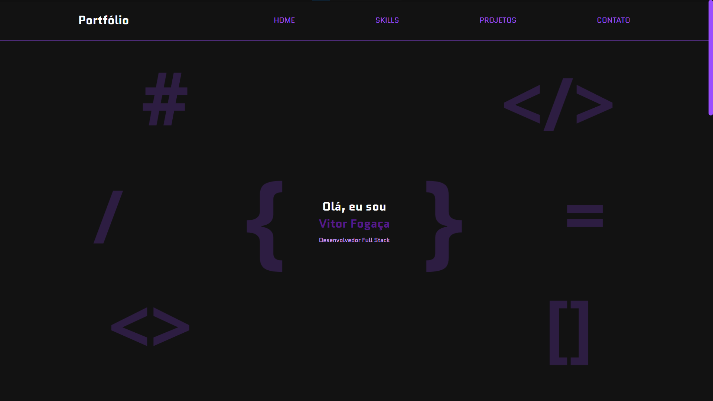

# Portfólio

Bem-vindo ao meu portfólio! Este repositório contém informações sobre meus projetos, habilidades e formas de contato.

## Índice

- [Sobre](#sobre)
- [Habilidades](#habilidades)
- [Projetos](#projetos)
- [Recursos Utilizados](#recursos-utilizados)
- [Contato](#contato)
- [Licença](#licença)

## Sobre

Este portfólio foi criado para mostrar meus projetos e habilidades como desenvolvedor Full Stack. Aqui você encontrará uma coleção de trabalhos que realizei ao longo da minha carreira.

## Habilidades

- 
- 
- 
- 
- 
- 
- 

## Projetos

### FerUnhas

- **Descrição:** Projeto desenvolvido como trabalho final no Curso Técnico de Desenvolvimento de Sistemas do SENAI.
- **Tecnologias Utilizadas:** Spring Boot (Java), MySQL, Figma, HTML, CSS, JavaScript.
- **Link:** [Ver projeto](https://github.com/mxcompany/FerUnhas)

### Cassino Velho Oeste

- **Descrição:** Projeto desenvolvido com intuito de testar conhecimentos lógicos de JavaScript (Sorteio de imagens, teste de posições, apostas e ganhos).
- **Tecnologias Utilizadas:** HTML, CSS e JavaScript.
- **Link:** [Ver projeto](https://github.com/vitorh07/cassino)

### API Usuário

- **Descrição:** API simples para cadastro, login e visualização de informações do usuário.
- **Tecnologias Utilizadas:** Spring Boot (Java), HTML, CSS e Java Script.
- **Link:** [Ver projeto](https://github.com/vitorh07/user-simples)

## Recursos Utilizados

- 
- 
- 
- 

## Contato

- **Email:** [vitorfogaca0227@gmail.com](mailto:vitorfogaca0227@gmail.com)
- **WhatsApp:** [(15) 99107-7691](https://wa.me/5515991077691)
- **LinkedIn:** [Vitor Fogaça](https://www.linkedin.com/in/vitor-foga%C3%A7a/)
- **GitHub:** [vitorh07](https://github.com/vitorh07)

## Licença

Este projeto está licenciado sob a Licença MIT. Veja o arquivo LICENSE para mais detalhes.
